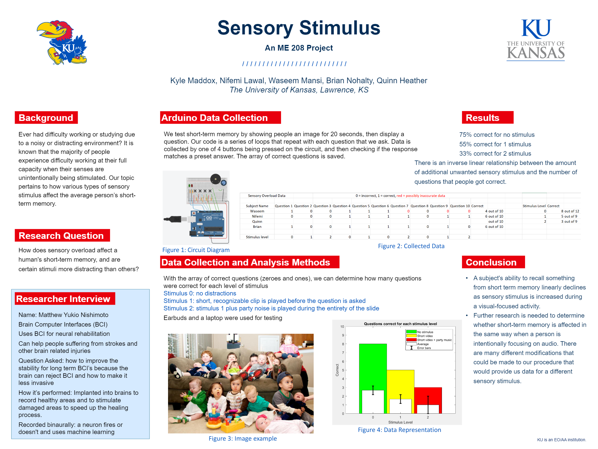

# Sensory Stimulus Research Project

## Overview
This repository contains the source code and documentation for the "Sensory Stimulus Research Project" I conducted alongside 4 students at the University of Kansas. The project investigates how different levels of sensory stimuli affect short-term memory, with a specific focus on auditory and visual distractions.

## Research Question
The primary research question addressed is:
**"How does sensory overload affect a human's short-term memory, and are certain stimuli more distracting than others?"**

## Repository Contents
- `mDatahandling.m` - MATLAB script for data analysis.
- `Arduino_Code.ino` - Arduino code for the data collection hardware setup.
- `ResearchPoster.pdf` - Detailed poster explaining the research methodology, data collection, and initial findings.

## Key Findings
- There is an inverse linear relationship between the level of sensory stimulus and the accuracy of short-term memory recall.
- Under no stimulus conditions, subjects showed 75% accuracy in recalling information. This accuracy decreased to 55% with a mild stimulus and further down to 33% under intense stimulus conditions.

## Data Collection
Data is collected using an Arduino setup where participants respond to memory tests after being exposed to various levels of stimuli. The stimuli include:
- **Stimulus 0**: No distractions.
- **Stimulus 1**: A short, recognizable clip played before the question.
- **Stimulus 2**: Continuous party noise played along with the clip from Stimulus 1.
  
## Research Poster

  

